# Evaluation — Sprint RAG-1A

## Por que este diretório existe

Este diretório existe para medir retrieval antes de introduzir memória, MCP,
LangGraph ou qualquer nova camada de orquestração.

A hipótese do Sprint RAG-1A é:

> Hybrid retrieval (dense + sparse) melhora significativamente o recall de
> queries financeiras brasileiras em comparação a dense-only.

Sem benchmark, essa hipótese não pode ser validada ou refutada com rigor.

## Filosofia

- Medir antes de construir.
- Sem número, não há ciência; há entusiasmo.
- O benchmark deve ser adversarial para dense-only: cada query precisa depender
  de um detalhe do corpus sintético local, não de conhecimento paramétrico do
  modelo.
- Tickers, siglas, jargão BR, cenários sintéticos e termos multilingual são
  exatamente o tipo de consulta que similaridade semântica pura tende a perder.
- Este PR define contrato e goldset placeholder. Ele não executa retrieval,
  embeddings, Qdrant, BM25, reranking ou geração.

## Definição de query adversarial

Uma query adversarial para este benchmark deve cumprir as três condições:

- A resposta correta só deve existir no corpus sintético local.
- Dense-only deve ter chance real de recuperar o documento errado por
  polissemia, proximidade semântica espúria ou perda de exact match.
- O resultado de retrieval deve ser verificável por `expected_doc_ids` e
  `expected_terms`, sem depender da memória do modelo.

Perguntas paramétricas genéricas, como "o que é duration?" ou "como calcular
EBITDA?", não pertencem a este benchmark.

## Categorias de query

| Código | O que testa |
|---|---|
| ticker | Exact match de código B3, como PETR4 e VALE3 |
| fii | Fundos imobiliários: DY, vacância, tipo e segmento |
| renda_fixa | LCI, CRI, CDB, debêntures e crédito privado |
| macro_br | Selic, IPCA, duration, spread e curva de juros |
| estrategia | Rebalanceamento, risco, correlação e alocação |
| siglas | Termos técnicos como PVPA, CDI e VPA |
| multilingual | Termos PT/EN misturados do mercado brasileiro |

## Schema de benchmark_queries.yaml

Cada query deve ter estes campos:

- `id`: identificador estável no formato `CATEGORIA_NNN`.
- `query`: texto sintético da consulta.
- `category`: uma das 7 categorias oficiais.
- `expected_doc_ids`: lista não vazia de documentos relevantes esperados.
- `expected_terms`: lista não vazia de termos que devem aparecer em chunks
  relevantes.
- `notes`: campo opcional para contexto de revisão.

Prefixos válidos:

| Categoria | Prefixo |
|---|---|
| ticker | TICKER |
| fii | FII |
| renda_fixa | RENDA_FIXA |
| macro_br | MACRO_BR |
| estrategia | STRAT |
| siglas | SIGLA |
| multilingual | MULTI |

IDs são imutáveis depois de criados. Se uma query for removida, o ID fica
aposentado e não deve ser reaproveitado.

## expected_results.yaml

`expected_results.yaml` mapeia `query_id -> doc_id -> relevance_grade`.

Graus de relevância:

- `2`: altamente relevante.
- `1`: parcialmente relevante.
- `0`: irrelevante.

Os IDs de documento deste PR são placeholders sintéticos. PRs futuros podem
substituí-los por IDs reais do corpus validado, mas sem renumerar queries.

## Como contribuir com novas queries

1. Escolha uma categoria existente.
2. Crie um ID estável no formato `CATEGORIA_NNN`.
3. Preencha todos os campos obrigatórios.
4. Ancore a pergunta em um documento, corpus, cenário, cláusula, marcador,
   gatilho, proxy, nota ou regra sintética local.
5. Nunca use dados reais de portfólio, conta, corretora, saldos, posições,
   documentos privados ou qualquer conteúdo Level 0.
6. Abra PR com issue vinculada e explique qual lacuna de retrieval a query
   mede.

## O que não vai aqui

- Dados reais de portfólio ou corretora.
- Segredos, credenciais, documentos privados ou dados pessoais.
- Resultados locais de benchmark. `evaluation/results/` é área local e deve
  ficar fora do versionamento, exceto `.gitkeep`.
- Código de retrieval, embeddings, Qdrant, BM25, LiteLLM, MemoryOS, LangGraph,
  MCP, ColBERT ou DBSF.

## PR 02 — Decisão de escopo sobre MAP

O motor matemático do PR 02 exporta apenas as funções do contrato final do PR:
precision@k, recall@k, reciprocal rank, MRR, DCG/NDCG e percentis de latência.

`mean_average_precision(results, k)` aparece no planejamento técnico como uma
possível macro-métrica, mas não aparece na lista final de funções obrigatórias
do PR 02. Por isso, MAP está explicitamente fora do escopo deste PR.

Motivo: adicionar MAP sem um contrato próprio exigiria escolher silenciosamente
a definição de AP@k, incluindo denominador, tratamento de duplicatas, cutoff e
queries sem hits. Essa decisão matemática precisa ser feita em PR separado,
com testes analíticos próprios, antes de entrar na API pública.

## Runbook de Benchmark A/B Dense — PR 04C

Este runbook descreve como executar e interpretar o benchmark comparativo entre
o dense atual (`nomic_dense_v1`) e o candidato `qwen3_dense_8b_v1`. O objetivo
é decidir com números se Qwen3 deve virar baseline denso antes dos sprints de
hybrid retrieval e Agentic RAG.

O PR 04C é um tribunal imparcial: ele mede primeiro, compara depois e só então
aplica o gate de decisão. Ele não promove Qwen3 automaticamente, não altera
`active_profile`, não implementa BM25, não implementa hybrid search, não cria
reranker e não adiciona agentes.

### Pré-requisitos locais

- Python 3.12 via `uv`.
- Corpus sintético já preparado para os dois perfis comparados.
- `benchmark_queries.yaml` e `expected_results.yaml` sem mudanças entre runs.
- Qdrant local disponível somente para leitura/escrita em collections
  declaradas para benchmark ou shadow.
- Perfil atual `nomic_dense_v1` disponível.
- Perfil candidato `qwen3_dense_8b_v1` validado pelo contrato de embeddings.
- Dependências opcionais de Qwen3 instaladas apenas no ambiente local de
  benchmark, nunca como exigência de testes unitários.

Qwen3 é pesado. Se o modelo real não estiver disponível, o benchmark real deve
falhar com mensagem clara ou rodar apenas em modo dry-run/fake, sem produzir
decisão de promoção.

### Comando esperado

Quando o runner do PR 04C estiver disponível, execute localmente:

```bash
uv run python -m evaluation.compare_dense_embeddings \
  --baseline-profile nomic_dense_v1 \
  --candidate-profile qwen3_dense_8b_v1 \
  --benchmark evaluation/benchmark_queries.yaml \
  --expected-results evaluation/expected_results.yaml \
  --output-dir evaluation/results
```

Os arquivos gerados devem ficar em `evaluation/results/`:

- `dense_embedding_ab.csv`: linhas por query e por profile.
- `dense_embedding_ab.json`: resumo, hashes, agregados e `decision_gate`.
- `dense_embedding_ab.md`: relatório humano com tabelas, gráficos e veredito.

Esses resultados são locais e não devem ser versionados quando grandes,
sensíveis ou dependentes de hardware. O conteúdo permitido é apenas IDs,
scores, métricas, hashes e metadados seguros. Nunca salvar chunks, embeddings,
payload completo, prompt, resposta gerada ou dados Level 0.

### Fairness obrigatório

O benchmark só é válido se Nomic e Qwen3 usarem exatamente os mesmos inputs:

- Mesmo arquivo de benchmark.
- Mesmo arquivo de ground truth.
- Mesmo corpus snapshot.
- Mesmo chunking.
- Mesmo `top_k`.
- Mesmas métricas.
- Nenhum filtro especial favorecendo um perfil.

O runner deve abortar se os hashes divergirem:

```python
if nomic_result.benchmark_hash != qwen3_result.benchmark_hash:
    raise ValueError("A/B benchmark must use identical benchmark queries")

if nomic_result.corpus_hash != qwen3_result.corpus_hash:
    raise ValueError("A/B benchmark must use identical corpus snapshot")
```

### Métricas obrigatórias

Qualidade:

- `precision@5`
- `recall@10`
- `MRR`
- `NDCG@5`

Latência:

- `ingest_latency_p50_ms`
- `ingest_latency_p95_ms`
- `query_latency_p50_ms`
- `query_latency_p95_ms`
- `embedding_latency_p50_ms`
- `embedding_latency_p95_ms`

Metadados de comparação:

- `vector_dimensions`
- `collection_size`
- `benchmark_hash`
- `corpus_hash`
- `profile_id`

### Como ler o resultado

Para qualidade, maior é melhor. Para latência, menor é melhor.

O relatório Markdown deve deixar explícito:

- Qual perfil foi mais preciso.
- Qual perfil foi mais rápido.
- Quanto Qwen3 ganhou ou perdeu em relação ao Nomic.
- Se o ganho de qualidade compensa a penalidade de latência.
- Qual perfil foi aceito pelo gate.

Tabela humana mínima:

| Métrica | Nomic | Qwen3-8B | Diferença | Vencedor |
|---|---:|---:|---:|---|
| Precision@5 | 0.42 | 0.55 | +31.0% | Qwen3 |
| Recall@10 | 0.62 | 0.78 | +25.8% | Qwen3 |
| MRR | 0.44 | 0.59 | +34.1% | Qwen3 |
| NDCG@5 | 0.51 | 0.67 | +31.4% | Qwen3 |
| Query p95 ms | 180 | 920 | 5.1x mais lento | Nomic |
| Embedding p95 ms | 35 | 2100 | 60.0x mais lento | Nomic |

Gráfico de qualidade esperado no Markdown:

```mermaid
xychart-beta
  title "Qualidade de Retrieval — maior é melhor"
  x-axis ["Precision@5", "Recall@10", "MRR", "NDCG@5"]
  y-axis "Score" 0 --> 1
  bar "Nomic" [0.42, 0.62, 0.44, 0.51]
  bar "Qwen3-8B" [0.55, 0.78, 0.59, 0.67]
```



Gráfico de latência esperado no Markdown:

```mermaid
xychart-beta
  title "Latência p95 (ms) — menor é melhor"
  x-axis ["Query p95", "Embedding p95"]
  y-axis "ms" 0 --> 2500
  bar "Nomic" [180, 35]
  bar "Qwen3-8B" [920, 2100]
```



Resumo humano esperado:

```text
Mais preciso: Qwen3-8B.
Mais rápido: Nomic.
Trade-off: Qwen3 melhora qualidade, mas aumenta a latência local.
Decisão: promover somente se o gate de qualidade e latência passar.
```

### Gate de decisão

Thresholds padrão:

- `min_recall10_relative_gain`: `0.10`
- `min_ndcg5_relative_gain`: `0.05`
- `max_query_p95_latency_multiplier`: `3.0`
- `max_embedding_p95_latency_multiplier`: `10.0`

Regra de promoção:

```python
promote = (
    qwen3.recall_at_10 >= nomic.recall_at_10 * 1.10
    and qwen3.ndcg_at_5 >= nomic.ndcg_at_5 * 1.05
    and qwen3.query_latency_p95_ms <= nomic.query_latency_p95_ms * 3.0
    and qwen3.embedding_latency_p95_ms <= nomic.embedding_latency_p95_ms * 10.0
)
```

O JSON deve incluir:

```json
{
  "decision_gate": {
    "promote_qwen3_dense": false,
    "accepted_profile": "nomic_dense_v1",
    "candidate_profile": "qwen3_dense_8b_v1",
    "reason": "Qwen3 improved quality but exceeded latency thresholds.",
    "thresholds": {
      "min_recall10_relative_gain": 0.10,
      "min_ndcg5_relative_gain": 0.05,
      "max_query_p95_latency_multiplier": 3.0,
      "max_embedding_p95_latency_multiplier": 10.0
    }
  }
}
```

Se `promote_qwen3_dense=false`, o baseline aceito continua sendo Nomic. Se
`promote_qwen3_dense=true`, Qwen3 ainda não deve virar runtime default neste
mesmo PR; a promoção operacional deve acontecer em PR separado.

### ADR de decisão

O PR 04C deve gerar ou atualizar uma ADR curta em `docs/ADR/` com:

- Contexto do A/B.
- Perfis comparados.
- Hashes de benchmark e corpus.
- Resultado de qualidade.
- Resultado de latência.
- `accepted_profile`.
- `promote_qwen3_dense`.
- Motivo da decisão.
- Fora de escopo: BM25, hybrid search, reranker e Agentic RAG.

A ADR deve registrar a decisão, não vender tecnologia. Se Qwen3 for mais
preciso, mas lento demais para o baseline local, isso deve aparecer de forma
direta: Qwen3 venceu qualidade, Nomic venceu latência, e o gate decidiu com
base nos thresholds.
